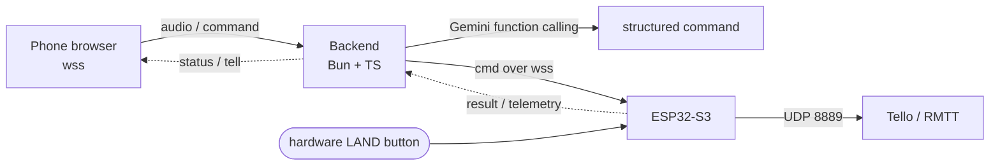
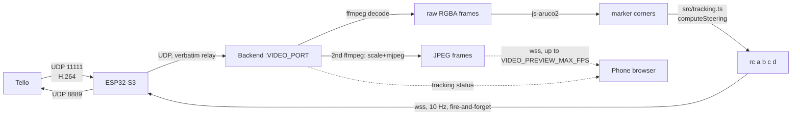

# tellovoice — voice-controlled DJI Tello over a cloud backend

Speak a flight command into a phone browser; a cloud backend turns it into a
structured Tello command via Gemini and relays it to an ESP32-S3 on the phone's
hotspot, which drives the drone over UDP.



## Why this shape

- **Browser needs a secure context** (`getUserMedia`, and no mixed content), so it
  talks only to the backend over real HTTPS/`wss` — no per-device certificate pain.
- **ESP32 is behind the phone hotspot NAT**, so it *dials out* to the backend
  (`wss` client) and the backend pushes commands down that socket. The backend can
  never connect to the ESP32 first.
- **Safety never depends on the internet.** The ESP32 handles keepalive locally
  (idle `battery?` every 5 s to dodge Tello's 15 s no-command auto-land) and a
  **physical LAND button** sends `land` straight to the Tello over UDP even if the
  backend, cellular, or Wi-Fi uplink is down.

## Layout

| Path | What |
|---|---|
| `src/protocol.ts` | **Frozen wire contract** shared by all three tiers. Start here. |
| `src/server.ts` | Bun HTTP + dual WebSocket server (`/ws/browser`, `/ws/device`), relay + status. |
| `src/gemini.ts` | Audio → one `control_drone` function call (Gemini). |
| `src/tello.ts` | Command validation + mapping to Tello SDK strings; reply parsing. |
| `src/tracking.ts` | ArUco detection (video ingest, ffmpeg decode, steering law) for marker-follow. |
| `src/*.test.ts` | Unit (mapping) + end-to-end plumbing (real subprocess, simulated browser+device). |
| `web/` | **Frontend.** Vite + React 19 + TypeScript + Tailwind v4 + shadcn/ui. See below. |
| `firmware/` | PlatformIO ESP32-S3 project. See `firmware/README.md`. |

## Run the backend

```bash
bun install
cp .env.example .env      # set GEMINI_API_KEY, DEVICE_TOKEN, BROWSER_TOKEN
bun run start             # or: bun run dev  (watch mode)
```

The backend serves the frontend's **built** static files from `public/` (see
below) — `bun run start` alone won't have a UI to serve until you've run the
frontend build at least once.

- Open `http://<host>:<PORT>/?token=<BROWSER_TOKEN>`.
- `GET /health` reports `{ ok, deviceOnline, battery }`.
- Voice needs `GEMINI_API_KEY`; without it the buttons still fly the drone.

## Run the frontend

```bash
cd web
bun install
bun run dev      # HMR dev server (proxies /ws, /health, /selftest to the
                  # backend on :8080 -- run the backend separately alongside)
```

`web/src/lib/ws-protocol.ts` re-exports the wire-contract types straight from
`../src/protocol.ts` (a relative import across the two project roots) so the
frontend can never drift from the backend's message shapes without a compile
error. `web/` is a fully separate `package.json`/`bun.lock` (its own
toolchain — React, Vite, Tailwind, shadcn/ui — kept out of the backend's
dependency tree), analogous to how `firmware/` is its own project.

For an integrated production-like preview on one port (matching how Docker
actually deploys it):

```bash
cd web && bun run build   # tsc -b && vite build -> web/dist/ (vite's default outDir)
cd .. && rm -rf public && cp -r web/dist public   # match the Dockerfile's copy step
bun run start             # backend now serves the built UI from public/
```

`public/` is gitignored — it's pure build output. In the Docker image this
copy is the multi-stage build's job (`COPY --from=web-build /app/web/dist
./public`, see below); for a local one-port preview you do it by hand as
above -- vite does NOT write directly to `../public/`.

### Production (secure context)

The phone browser must load over **HTTPS** and connect over **wss** (mic + no mixed
content). Put the backend behind a TLS terminator with a real certificate — e.g. a
managed platform (Cloud Run / Fly / Render) or nginx/Caddy with Let's Encrypt.
Given a 1 GbE backend host, the extra internet hop for command relay adds only
~100–300 ms on top of the (dominant) STT+LLM latency.

The `Dockerfile` is multi-stage: stage 1 builds `web/` (needs `src/protocol.ts`
copied alongside it for the cross-root type import) and produces static
files; stage 2 is the backend image, which copies that build output straight
into `public/`. One container, one `bun run src/server.ts` process, serving
both the API/WebSocket endpoints and the built UI — no separate frontend
host/CDN, no second server process.

## Tests

```bash
bun test          # unit + e2e plumbing (no Gemini key required)
bun run typecheck # tsc --noEmit
```

The plumbing test spawns the real server and drives a simulated browser and ESP32
over WebSocket, asserting the full relay round-trip, battery status, telemetry
broadcast, and pre-dispatch validation.

## Firmware & drone setup

See **`firmware/README.md`** for the ESP32-S3 build, the emergency-button wiring
(GPIO0 → GND), the `setInsecure()` TLS caveat, and the one-time Tello **`ap`**
command that joins the drone to the phone hotspot in station mode.

### Field checklist (verify before relying on the demo)

1. **Phone hotspot is 2.4 GHz** (Tello is 2.4 GHz-only; iOS: "Maximize Compatibility").
2. **Hotspot SSID is alphanumeric**, no spaces/Korean/symbols (Tello `ap` rejects them).
3. **Client isolation is OFF** — ESP32 and Tello must reach each other on the hotspot
   LAN. Confirm by watching for the firmware's `tello_found` event / a `battery?` reply.
4. **Turn off iCloud Private Relay / VPN** on the phone (breaks local + relay routing).
5. **Emergency LAND button works with Wi-Fi/backend pulled** (the real safety backstop).

## Command set

`takeoff`, `land`, `emergency`, `up/down/left/right/forward/back {20–500 cm}`,
`cw/ccw {1–360°}`, `flip {l/r/f/b}`, `battery?`, `streamon`/`streamoff` (used
internally by marker-follow, not exposed as a voice command). Out-of-range args
are rejected (not clamped) before dispatch — the drone never flies a distance
you didn't say.

## ArUco marker-follow

A second, independent control mode: the browser toggles it on/off (`{type:
"track", on}`); the drone then autonomously turns/climbs/moves to keep a
detected ArUco marker centered and at a set distance, using continuous `rc`
joystick commands instead of the discrete move commands above.



- **Video is out of band, and needs its OWN port reachable.** Tello's H.264
  stream never touches the WS JSON protocol — the ESP32 sends raw UDP packets
  directly to the backend's `VIDEO_PORT` (default 8890), independent of the
  `wss` connection entirely. **This means `VIDEO_PORT` must be reachable from
  the ESP32 as its own UDP port** — a typical reverse-proxy domain mapping
  (Dokploy/Traefik, etc.) only forwards the HTTP(S)/`wss` port and does *not*
  cover this. See the Dockerfile's `EXPOSE 8890/udp` comment for exactly what
  to configure at the host/platform level; voice and manual control don't
  need this (they're `wss`-only), only tracking/preview do.
- **Two independent ffmpeg processes consume the same UDP bytes.** One
  (`TrackingSession`) decodes to raw RGBA for `js-aruco2` marker detection;
  the other (`VideoPreviewSession`) scales + re-encodes to JPEG for the
  browser's live camera view. Neither depends on the other; killing/failing
  one never affects the other. See `src/tracking.ts`.
- **Live camera preview.** While tracking is active, the backend also pushes
  `{type:"frame", jpeg: <base64>}` over the same browser `wss` connection —
  no extra port, no WebRTC. Tunable via `VIDEO_PREVIEW_WIDTH` (output px
  width, aspect-preserved), `VIDEO_PREVIEW_QUALITY` (ffmpeg `-q:v`), and
  `VIDEO_PREVIEW_MAX_FPS` (forwarding rate cap, independent of ffmpeg's
  actual decode rate). The frontend renders it with a plain ``, updated
  imperatively outside React state so a ~10fps feed never re-renders the rest
  of the UI (see `useDroneSocket`'s `onFrame` subscription).
- **ffmpeg silently withholds ALL piped output until its input closes,
  by default.** This is a real ffmpeg characteristic (verified against the
  actual production `oven/bun:1.3-alpine` image, not a dev-machine quirk):
  fed via a live, indefinitely-open pipe (never hitting EOF), ffmpeg's
  default ~5MB input probe means it decodes/encodes NOTHING until that much
  data has arrived — which never happens for a continuous video feed. Both
  ffmpeg invocations in `src/tracking.ts` pass `-probesize 32768
  -analyzeduration 0` to cut this from an indefinite stall down to a ~1
  second warm-up, after which frames flow continuously. Don't remove these
  flags without re-verifying end-to-end with a real, unbounded feed (a short
  test file that finishes and closes stdin will look fine either way and
  mask a regression here).
- **`rc` never uses the reply-waiting dispatch path.** Tello does not ack `rc`
  the way it acks other commands, so it's a fire-and-forget send at a fixed
  10 Hz, independent of decode frame rate, with a 500 ms staleness failsafe
  (no fresh frame → `rc 0 0 0 0`, never repeat a stale command).
- **Any interruption stops it.** Emergency button, a manual command/voice
  sequence, `{type:"track",on:false}`, or the device disconnecting all zero the
  rc channels, call `streamoff`, and tear down both ffmpeg sessions — same
  interrupt-on-new-input principle as the multi-command voice sequencer
  (`abortSequence()` / `stopTracking()`).
- **Gains are deliberately gentle and signed.** `TRACK_MAX_RC` (default 35, of
  a possible ±100) caps every channel; `TRACK_YAW_GAIN`/`TRACK_ALT_GAIN`/
  `TRACK_DIST_GAIN` are plain multipliers — **if the drone turns/climbs/moves
  the wrong way on first test, flip that gain's sign in `.env`**, no code
  change needed. `ARUCO_TARGET_SIZE_PX` sets the follow distance (bigger =
  closer); tune empirically against your printed marker's real size.
- **v1 has no lateral strafe** (`rc`'s `a`/roll channel is always 0) — yaw
  alone re-centers horizontally, to avoid uncommanded sideways drift.

### Custom 4x4 markers (draw your own, no printer-shop dictionary lookup)

The `/marker` tab is both the marker *designer* and its *tracking config* in
one: click cells in a 4x4 grid to draw a black/white pattern, and that exact
pattern is simultaneously (a) rendered as a printable marker (SVG download or
direct print, true-to-size at 80mm) and (b) registered as what the ArUco
detector looks for once you hit "이 마커 추적하기" — no separate dictionary/ID
bookkeeping, the grid you drew *is* the marker.

- **How it works:** `{type:"set_marker", pattern}` (16 booleans, row-major,
  `true`=white) registers a one-marker custom js-aruco2 dictionary at runtime
  (`registerCustomMarker` in `src/tracking.ts`) and takes effect on the next
  `{type:"track",on:true}`. `{type:"clear_marker"}` reverts to the static
  `ARUCO_DICTIONARY`/`ARUCO_TARGET_ID` config. The active pattern is broadcast
  to every connected browser (`{type:"marker_pattern"}`), so the designer tab
  and the tracking tab never disagree about what's being followed.
- **Rotation-invariant by construction.** js-aruco2's detector always tries
  all 4 rotations of what it sees against the registered pattern (not
  something this feature has to handle itself) — verified against the real
  library in `src/tracking.test.ts`, including a full print → (any camera
  rotation) → detect round trip.
- **`ARUCO_CUSTOM_TAU`** (default **2**, out of 16 bits) sets the match
  tolerance. Unlike the built-in multi-marker dictionaries, a custom
  single-marker dictionary can't auto-derive a sensible tau from pairwise
  code distances (there's only one code), so this is explicit and kept
  strict by default — a physical drone steering off a false-positive match
  on some unrelated bordered object in frame is worse than it occasionally
  missing its own marker in poor lighting. Raise it if legitimate detection
  is flaky; **never set it to `0`** expecting "exact match only" — js-
  aruco2 itself has a `dictionary.tau || this._calculateTau()` bug where an
  explicit `0` is falsy and silently substitutes `Number.MAX_VALUE` (matches
  anything) for a single-marker dictionary, so `registerCustomMarker` in
  `src/tracking.ts` clamps to a minimum of 1 — verified this can't regress
  in `src/tracking.test.ts`.

### Confirmed working

- **`streamon` in station mode does actually stream, reliably.** Verified live
  with a real Tello: after fixing `VIDEO_HOST` to bypass a Cloudflare-proxied
  domain (raw UDP never traverses standard Cloudflare proxying — point it at
  the origin server's real IP), a PSRAM `memory_type` boot-crash on the
  ESP32-S3 N16R8 module, and the ffmpeg pipe-stalls-until-EOF issue above,
  live camera preview + ArUco `tracking` telemetry both showed up in the web
  app from the real drone's station-mode stream. If yours doesn't: confirm
  `VIDEO_HOST` is the origin IP (not a proxied domain), `VIDEO_PORT` is
  actually reachable from the ESP32 (host firewall / platform port-publish
  config, not just the app's own UDP bind — see the port-forwarding note
  above), and check the firmware's periodic `[video] rx N pkts` log to see
  whether Tello is sending anything to the ESP32 at all before suspecting the
  ESP32 → backend leg.

### Known limitation: detection fails completely under heavy motion blur

Stress-tested js-aruco2 directly (real decode + detect, not just reasoning
about the algorithm) against compression, camera angle, marker distance, and
blur, independently and combined:

| condition | detection rate |
|---|---|
| baseline | 100% |
| light blur | 97.8% |
| low-bitrate compression (800kbps, Tello-ish) | 100% |
| off-angle camera | 100% |
| small marker (2.5x farther) | 100% |
| tiny marker (5x farther) | 100% |
| small + light blur + low bitrate combined | 100% |
| **heavy motion blur** | **0%** |

Compression, angle, and distance are all robust. Heavy blur is a hard,
binary failure — not js-aruco2-specific, it's inherent to any ArUco-style
detector (OpenCV's own C++ implementation has the identical weakness):
sharp black/white edge contrast is required to find marker candidates at
all, and blur destroys exactly that. Already covered by the existing
staleness failsafe (`STEERING_STALE_MS`, 500 ms → `rc 0 0 0 0`) — a blurry
moment means "stop and wait for a clean frame," not "steer off garbage."

### ⚠️ Unverified before a real flight

1. **Sign conventions for `rc`'s roll/pitch/throttle/yaw are unverified** —
   flip gain signs per-channel after watching the first real attempt.
2. **Fly over a soft/open area with prop guards on the first test.** Start
   with `TRACK_MAX_RC` low (e.g. 15–20) until the loop's behavior is confirmed
   sane, then raise it.

# Drone-Web-Server
