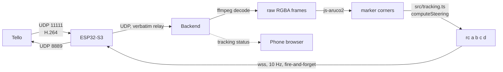

# tellovoice — voice-controlled DJI Tello over a cloud backend

Speak a flight command into a phone browser; a cloud backend turns it into a
structured Tello command via Gemini and relays it to an ESP32-S3 on the phone's
hotspot, which drives the drone over UDP.


## Why this shape

- **Browser needs a secure context** (`getUserMedia`, and no mixed content), so it
  talks only to the backend over real HTTPS/`wss` — no per-device certificate pain.
- **ESP32 is behind the phone hotspot NAT**, so it *dials out* to the backend
  (`wss` client) and the backend pushes commands down that socket. The backend can
  never connect to the ESP32 first.
- **Safety never depends on the internet.** The ESP32 handles keepalive locally
  (idle `battery?` every 5 s to dodge Tello's 15 s no-command auto-land) and a
  **physical LAND button** sends `land` straight to the Tello over UDP even if the
  backend, cellular, or Wi-Fi uplink is down.

## Layout

| Path | What |
|---|---|
| `src/protocol.ts` | **Frozen wire contract** shared by all three tiers. Start here. |
| `src/server.ts` | Bun HTTP + dual WebSocket server (`/ws/browser`, `/ws/device`), relay + status. |
| `src/gemini.ts` | Audio → one `control_drone` function call (Gemini). |
| `src/tello.ts` | Command validation + mapping to Tello SDK strings; reply parsing. |
| `src/tracking.ts` | ArUco detection (video ingest, ffmpeg decode, steering law) for marker-follow. |
| `src/*.test.ts` | Unit (mapping) + end-to-end plumbing (real subprocess, simulated browser+device). |
| `web/` | **Frontend.** Vite + React 19 + TypeScript + Tailwind v4 + shadcn/ui. See below. |
| `firmware/` | PlatformIO ESP32-S3 project. See `firmware/README.md`. |

## Run the backend

```bash
bun install
cp .env.example .env      # set GEMINI_API_KEY, DEVICE_TOKEN, BROWSER_TOKEN
bun run start             # or: bun run dev  (watch mode)
```

The backend serves the frontend's **built** static files from `public/` (see
below) — `bun run start` alone won't have a UI to serve until you've run the
frontend build at least once.

- Open `http://<host>:<PORT>/?token=<BROWSER_TOKEN>`.
- `GET /health` reports `{ ok, deviceOnline, battery }`.
- Voice needs `GEMINI_API_KEY`; without it the buttons still fly the drone.

## Run the frontend

```bash
cd web
bun install
bun run dev      # HMR dev server (proxies /ws, /health, /selftest to the
                  # backend on :8080 -- run the backend separately alongside)
```

`web/src/lib/ws-protocol.ts` re-exports the wire-contract types straight from
`../src/protocol.ts` (a relative import across the two project roots) so the
frontend can never drift from the backend's message shapes without a compile
error. `web/` is a fully separate `package.json`/`bun.lock` (its own
toolchain — React, Vite, Tailwind, shadcn/ui — kept out of the backend's
dependency tree), analogous to how `firmware/` is its own project.

For an integrated production-like preview on one port (matching how Docker
actually deploys it):

```bash
cd web && bun run build   # tsc -b && vite build -> ../public/
cd .. && bun run start    # backend now serves the built UI from public/
```

`public/` is gitignored — it's pure build output (the Dockerfile's first
stage produces it fresh; see below).

### Production (secure context)

The phone browser must load over **HTTPS** and connect over **wss** (mic + no mixed
content). Put the backend behind a TLS terminator with a real certificate — e.g. a
managed platform (Cloud Run / Fly / Render) or nginx/Caddy with Let's Encrypt.
Given a 1 GbE backend host, the extra internet hop for command relay adds only
~100–300 ms on top of the (dominant) STT+LLM latency.

The `Dockerfile` is multi-stage: stage 1 builds `web/` (needs `src/protocol.ts`
copied alongside it for the cross-root type import) and produces static
files; stage 2 is the backend image, which copies that build output straight
into `public/`. One container, one `bun run src/server.ts` process, serving
both the API/WebSocket endpoints and the built UI — no separate frontend
host/CDN, no second server process.

## Tests

```bash
bun test          # unit + e2e plumbing (no Gemini key required)
bun run typecheck # tsc --noEmit
```

The plumbing test spawns the real server and drives a simulated browser and ESP32
over WebSocket, asserting the full relay round-trip, battery status, telemetry
broadcast, and pre-dispatch validation.

## Firmware & drone setup

See **`firmware/README.md`** for the ESP32-S3 build, the emergency-button wiring
(GPIO0 → GND), the `setInsecure()` TLS caveat, and the one-time Tello **`ap`**
command that joins the drone to the phone hotspot in station mode.

### Field checklist (verify before relying on the demo)

1. **Phone hotspot is 2.4 GHz** (Tello is 2.4 GHz-only; iOS: "Maximize Compatibility").
2. **Hotspot SSID is alphanumeric**, no spaces/Korean/symbols (Tello `ap` rejects them).
3. **Client isolation is OFF** — ESP32 and Tello must reach each other on the hotspot
   LAN. Confirm by watching for the firmware's `tello_found` event / a `battery?` reply.
4. **Turn off iCloud Private Relay / VPN** on the phone (breaks local + relay routing).
5. **Emergency LAND button works with Wi-Fi/backend pulled** (the real safety backstop).

## Command set

`takeoff`, `land`, `emergency`, `up/down/left/right/forward/back {20–500 cm}`,
`cw/ccw {1–360°}`, `flip {l/r/f/b}`, `battery?`, `streamon`/`streamoff` (used
internally by marker-follow, not exposed as a voice command). Out-of-range args
are rejected (not clamped) before dispatch — the drone never flies a distance
you didn't say.

## ArUco marker-follow

A second, independent control mode: the browser toggles it on/off (`{type:
"track", on}`); the drone then autonomously turns/climbs/moves to keep a
detected ArUco marker centered and at a set distance, using continuous `rc`
joystick commands instead of the discrete move commands above.



- **Video is out of band.** Tello's H.264 stream never touches the WS JSON
  protocol — the ESP32 relays raw UDP packets verbatim to the backend's
  `VIDEO_PORT` (default 8890), which decodes with `ffmpeg` and detects markers
  with `js-aruco2` (pure JS, no native OpenCV build). See `src/tracking.ts`.
- **`rc` never uses the reply-waiting dispatch path.** Tello does not ack `rc`
  the way it acks other commands, so it's a fire-and-forget send at a fixed
  10 Hz, independent of decode frame rate, with a 500 ms staleness failsafe
  (no fresh frame → `rc 0 0 0 0`, never repeat a stale command).
- **Any interruption stops it.** Emergency button, a manual command/voice
  sequence, `{type:"track",on:false}`, or the device disconnecting all zero the
  rc channels and call `streamoff` — same interrupt-on-new-input principle as
  the multi-command voice sequencer (`abortSequence()` / `stopTracking()`).
- **Gains are deliberately gentle and signed.** `TRACK_MAX_RC` (default 35, of
  a possible ±100) caps every channel; `TRACK_YAW_GAIN`/`TRACK_ALT_GAIN`/
  `TRACK_DIST_GAIN` are plain multipliers — **if the drone turns/climbs/moves
  the wrong way on first test, flip that gain's sign in `.env`**, no code
  change needed. `ARUCO_TARGET_SIZE_PX` sets the follow distance (bigger =
  closer); tune empirically against your printed marker's real size.
- **v1 has no lateral strafe** (`rc`'s `a`/roll channel is always 0) — yaw
  alone re-centers horizontally, to avoid uncommanded sideways drift.

### ⚠️ Unverified before a real flight

1. **`streamon` while Tello is in station mode is not confirmed reliable.**
   Tello's video pipeline is best-documented in its own AP mode; behavior when
   joined to the ESP32's soft-AP (our setup) is community-reported as
   inconsistent, not officially guaranteed. **Test this first, in isolation:**
   toggle tracking on and confirm `markerFound` telemetry ever arrives (even
   `false` — it proves frames are decoding) before trusting the follow
   behavior. If no `tracking` message ever updates past the initial
   `{active:true, markerFound:false}`, video isn't reaching the detector —
   check `VIDEO_HOST`/`VIDEO_PORT` match on both ends and that the firmware
   log shows packets being relayed.
2. **Sign conventions for `rc`'s roll/pitch/throttle/yaw are unverified** —
   flip gain signs per-channel after watching the first real attempt.
3. **Fly over a soft/open area with prop guards on the first test.** Start
   with `TRACK_MAX_RC` low (e.g. 15–20) until the loop's behavior is confirmed
   sane, then raise it.

# Drone-Web-Server
